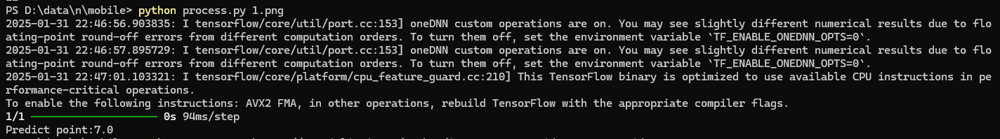
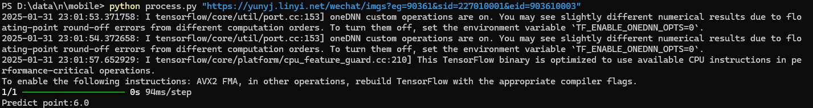

# Kung Kim Bon AI
## 现有功能
+ 应用文打分

### 应用文打分
***注: 此处应用文指临沂市2023级普通高中学科素养水平监测试卷(英语学科2025.1)***
#### 环境
+ Python3.7+
+ Package
  + tensorflow
  + requests
  + numpy
  + pillow 
#### Usage
```shell
git clone https://github.com/yishuiyizhong/KongKimBonAI.git
cd KongKimBonAI
```
参数为答题卡第一张图片,例如1.png
```shell
python process.py 1.png
```

或者是附上英语小题分链接
```shell
python process.py "https://yunyj.linyi.net/wechat/imgs?eg=90361&sid=227010001&eid=903610003"
```


## Source
Train训练代码:`train.ipynb`

Data数据集(只考虑sharp数据,即应用文):

  1. `Datar.py`(Python) or `Datar.js`(Nodejs) 爬取原始数据并切片 => #5.04GB
  2. `DataBaseProcess.py` 切片数据处理
  
  + 图像转为灰度,此时每个像素值为1-255
  + Trans 像素值以123为界划分为0或1
  + 每16 * 4的矩形按位合并值
  + Normalize 值除以2^64并转为float16 => #NormalFP16sharp.npy 1.48GB

  数据集下载:[v0.0.1α](https://github.com/yishuiyizhong/KongKimBonAI/releases/tag/v0.0.1-alpha)

# Plug
使用OneHot改进训练

详见
+ Training Source `OneHot-train.ipynb`
+ Model `KungKimBonAI-OheHot.keras`